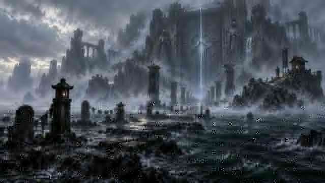

# TOMOB Landmark Visual Bible

- 작성일: 2026-09-29
- 상태: Landmark visual north-star v0.1
- 목적: 랜드마크 섬의 크기, 실루엣, 공간 구조, 구현 시 반드시 보존할 시각적 핵심을 고정한다.
- 원칙: 아래 컨셉아트는 포토리얼 그대로 복제하기 위한 이미지가 아니라 **게임 안에서 반드시 살아야 할 실루엣·공간 관계·감정의 기준 이미지**다.

---

# 0. Landmark Scale Rule

현재 `바람이 기억하는 섬`은 온보딩과 세계 문법 소개를 위한 시작섬이다.
다른 랜드마크는 이 시작섬보다 **훨씬 큰 체급**으로 제작한다.

## 크기 목표

| 구분 | 디자인 목표 |
|---|---:|
| 현재 시작섬 | 약 360m 지형 클래스 |
| 랜드마크 최소 | 800m+ |
| 표준 랜드마크 | 1.0~1.4km |
| 초대형 도시/지역 랜드마크 | 1.6~2.2km |
| 주요 구역 | 5~8개 이상 |
| 공간 레이어 | 2~4개 |
| 메인 탐험 | 약 30~60분 |
| 완전 탐험 | 약 60~120분 |

이 수치는 월드 제작을 위한 **디자인 목표**이며 최종 구현에서 성능과 이동 속도에 맞게 조정한다.

핵심은 숫자가 아니라 다음 체감이다.

> 시작섬은 '섬 하나를 탐험했다'는 느낌이고,
> 랜드마크는 '지역 하나를 여행했다'는 느낌이어야 한다.

따라서 랜드마크는 한 화면에 모든 것을 노출하지 않는다.
바다에서 접근할 때는 대표 실루엣만 보이고, 상륙 후 여러 공간을 통과하며 내부 규모가 계속 확장되어야 한다.

## 기술 제작 원칙

- 하나의 초대형 메시로 만들지 않는다.
- 약 150~250m 단위의 구역/섹터로 제작한다.
- 바다에서 보이는 원거리 실루엣 LOD와 근거리 상세 레이어를 분리한다.
- 다음 구역은 능선, 절벽, 안개, 건축물로 가렸다가 열어준다.
- 랜드마크 전체를 한 번에 렌더하지 않아도 동일한 규모감이 유지되어야 한다.

---

# 1. 밧모 해역 — 절벽에 매달린 도시

## 구현 상태

- V1: 구조 검증 실패. 거대한 매끈 벽 + 공중 플랫폼처럼 읽혀 폐기.
- **V2: `sandbox-landmark-patmos-v2.html`**
- V2 핵심 변경: S자 수로, 불규칙 능선, 절벽에 매몰된 석조 테라스, 건물 클러스터, 짧은 다리, 암시장 동굴, 상층 성채.
- 기준: 도시보다 지형이 먼저 읽히되, 항구 내부에서는 건축 덩어리가 반드시 시야에 들어와야 한다.

## North Star

> **거대한 절벽 안쪽에 숨겨진 밀수 도시.**
> 외해에서는 험한 바위섬처럼 보이지만 좁은 수로를 통과하면 절벽 전체에 붙은 도시가 열린다.

## 목표 크기

- 전체 권역: 약 **1.0~1.3km**
- 최대 고도차: **250~350m**
- 내부 항만: 약 **180~250m**
- 핵심 탐험 구역: 6~7개

## 반드시 살아야 하는 5가지

1. **바다에서 먼저 읽히는 압도적인 수직 절벽**
2. 외해에서는 도시 대부분이 보이지 않는 **숨은 입구**
3. 절벽 전체에 층층이 매달린 **목재 도시**
4. 하층 항구 → 중층 암시장 → 상층 감시대로 이어지는 **수직 공간 구조**
5. 오래된 석조 유산 위에 밀수꾼들이 덧댄 현재의 생활 구조

## 공간 구조

### P1 — 외해 절벽
거대한 바위벽과 작은 감시대만 보인다.
도시의 본체는 숨긴다.

### P2 — 좁은 진입 수로
배 한두 척이 지나갈 정도의 협곡.
회전을 끝내는 순간 내부 항구가 처음 열린다.

### P3 — 숨은 항구
창고, 밀수선, 크레인, 화물, 작은 선착장이 빽빽하게 존재한다.

### P4 — 절벽 하층 도시
목재 발판, 계단, 밧줄다리, 매달린 집.

### P5 — 암시장 동굴
절벽 안쪽의 거대한 동굴을 현재 도시가 점유한다.
게임플레이 허브가 될 수 있다.

### P6 — 상층 감시 지구
사냥꾼과 경계병의 공간.
바다와 다른 섬들을 조망한다.

### P7 — 숨은 옛 성소
현재의 밧모보다 오래된 석조 문명.
차원문/분깃과 연결 가능.

## 컨셉아트에서 그대로 가져올 것

- 물과 맞닿은 검고 젖은 암벽
- 붉고 탁한 천막
- 따뜻한 등불과 차가운 해안색의 대비
- 바위 사이를 잇는 다리
- 깊숙이 들어갈수록 증가하는 생활 밀도

## 그대로 복제하지 않을 것

- 컨셉아트의 초고밀도 개별 건물 수
- 포토리얼 재질
- 한 화면에 모든 도시가 보이는 구성

게임에서는 더 큰 규모로 확장하되 **3~4개의 절벽 챔버로 도시를 나눠 순차적으로 공개**한다.

---

# 2. 잠긴 왕국 — 바다 아래의 왕도

## North Star

> **여러 섬처럼 보였던 것들이 사실 하나의 거대한 왕도에서 물 위로 남은 고지대였다.**

이 지역은 단일 섬보다 **수몰 수도권 전체**에 가깝다.

## 목표 크기

- 전체 왕도 권역: 약 **1.6~2.2km**
- 중심 왕궁권: 약 **400~600m**
- 수몰 중심대로: 최소 **500~800m**
- 핵심 탐험 구역: 7~9개

7개 랜드마크 중 가장 넓은 축에 둔다.

## 반드시 살아야 하는 5가지

1. 배에서 보면 흩어진 군도처럼 보이는 **탑과 고지대**
2. 가까워질수록 물속에서 서로 연결되는 **도시 구조**
3. 수면 아래 끝까지 보이는 **왕도 중심대로**
4. 멀리서 계속 방향 기준이 되는 **왕궁 고지**
5. 작은 폐허가 아니라 과거 수도 전체가 잠겼다는 **문명 규모감**

## 공간 구조

### K1 — 침수 외곽
민가 지붕과 성벽 상단이 물 위로 남아 있다.

### K2 — 옛 항만
현재 탐사자들이 사용하는 작은 임시 부두.
옛 왕국 항구 구조와 겹친다.

### K3 — 수몰 주거지
얕은 물 아래 골목, 계단, 주거 건축이 보인다.

### K4 — 중심대로
왕궁으로 이어지는 도시의 SSOT 축.
탐험 중 여러 번 다시 보이도록 한다.

### K5 — 대광장/성전지구
열주, 조각상, 광장, 성전의 규모를 보여준다.

### K6 — 왕궁 하부
반쯤 침수된 회랑과 왕궁 기반.

### K7 — 왕궁 고지
가장 큰 수면 위 육지.
멀리서부터 보이는 메인 실루엣.

### K8 — 침수 심부
도시의 더 낮은 구역.
수중/수로 플레이 확장 가능.

### K9 — 왕국 성소
분깃과 세계관의 핵심 장소.

## 컨셉아트에서 그대로 가져올 것

- 맑은 물 아래 보이는 도시 축
- 밝은 왕실 석재와 청록 물의 대비
- 수면 위로 솟은 아치와 탑
- 높은 왕궁이 전체 지역의 목적지가 되는 구성
- 현재 생존자의 작은 목재 구조와 고대 왕도의 극단적인 스케일 차이

## 구현 시 가장 중요한 기준

> **물을 빼도 도시 지도가 성립해야 한다.**

무작위 유적을 물에 배치하는 것이 아니라
대로, 광장, 주거지, 왕궁이 도시계획으로 연결되어야 한다.

---

# 3. 스올 해역 — 안개 속 거대한 봉인문

## North Star

> **섬보다 먼저 거대한 문이 보이는 성역.**
> 플레이어는 하나의 섬을 탐험한다기보다 오랜 시간 봉인된 경계를 향해 전진한다.

## 목표 크기

- 전체 성역: 약 **1.2~1.6km**
- 순례축: 약 **600~900m**
- 거대한 봉인문 높이: **180~250m급 실루엣**
- 핵심 탐험 구역: 6~8개

문 자체가 배에서도 인식될 정도로 과장되어야 한다.

## 반드시 살아야 하는 5가지

1. 수평선/안개 너머에서 먼저 보이는 **초대형 봉인문**
2. 문으로 직선적으로 이어지는 **침수 순례축**
3. 이동하면서 나타났다 사라지는 안개 속 건축
4. 공포보다 **경외와 금기**가 먼저 느껴지는 성역
5. 누군가 오랫동안 이곳을 관리하고 지켜왔다는 파수꾼의 흔적

## 공간 구조

### S1 — 외해 안개권
섬의 윤곽보다 문 상부가 먼저 보인다.

### S2 — 안개 접안지
소박하고 조용한 돌부두.
일반 도시 항구처럼 북적이지 않는다.

### S3 — 침수 순례길
물이 길을 끊었다 이어준다.
문은 보였다 사라지기를 반복한다.

### S4 — 묘역/기억의 뜰
죽음의 공포가 아니라 오래된 기억과 의식을 표현한다.

### S5 — 문지기 성소
파수꾼의 현재 거점.
인간 규모의 공간이 처음 등장한다.

### S6 — 봉인 회랑
거대한 문의 체급을 준비시키는 건축 전이구간.

### S7 — 대봉인문
모든 시선이 모이는 절대 랜드마크.

### S8 — 내측 성소
문 뒤 혹은 아래.
분깃/차원문/심판 서사와 연결한다.

## 컨셉아트에서 그대로 가져올 것

- 검고 젖은 바위와 차가운 바다
- 낮게 깔린 안개
- 길을 따라 반복되는 석등/기둥
- 압도적으로 큰 문
- 미세한 청백색 봉인광

## 피해야 할 것

- 좀비섬
- 고어
- 흔한 묘지 던전
- 전 지역을 무조건 검게 만드는 것

스올은 **죽음의 장소가 아니라 경계를 지키는 장소**다.

---

# 4. 세 이미지의 역할

이 세 이미지는 앞으로 제작 과정에서 다음 판단의 기준으로 사용한다.

### 밧모
“절벽에 도시가 실제로 붙어 있는가?”

### 잠긴 왕국
“이곳이 수몰된 도시 전체로 느껴지는가?”

### 스올
“문 하나만으로 지역의 존재 이유가 설명되는가?”

이 질문에 아니오라면 디테일을 더하는 것이 아니라
지형/실루엣/랜드마크 배치부터 다시 수정한다.

---

# 5. 다음 Visual Reference

현재 저장 완료:
- Landmark 02 — 밧모
- Landmark 05 — 잠긴 왕국
- Landmark 06 — 스올

추가 제작 대상:
- Landmark 03 — 봉우리
- Landmark 04 — 아라랏
- Landmark 07 — 얼음 외해

Landmark 01 시작섬은 실제 게임 빌드 자체가 기준 레퍼런스 역할을 한다.
